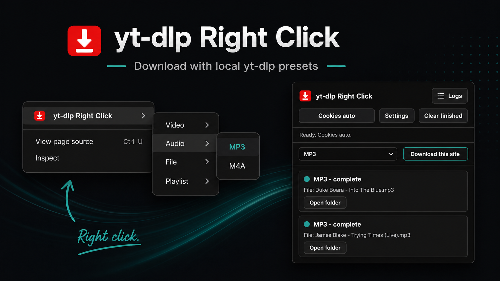

# yt-dlp Right Click

<p align="center">
  
</p>

<p align="center">
  <a href="https://github.com/biggiesmallcap-blip/yt-dlp-right-click/releases/tag/v1.0.0"></a>
  
  
  
</p>

`yt-dlp Right Click` is a local Chrome extension for Windows that sends page, link, selected-text, and media URLs to safe local `yt-dlp` presets through a Rust native messaging host.

The browser extension handles the UI. The native host owns local execution, validates every request, and launches `yt-dlp.exe` directly without a shell.

## Highlights

- Right-click any page, link, selected URL, image, video, or audio element.
- Download from a compact popup when right-click capture is awkward.
- Use preset-only commands for MP4 video, MP3/M4A audio, best file, and explicit playlists.
- Track active jobs with the extension badge and recent jobs in the popup.
- Open completed download folders and retry failed jobs.
- Keep filenames clean with `Title.ext` output instead of noisy video IDs.
- Retry with Chrome cookies only when `yt-dlp` reports that login or cookies are required.
- Detect local JavaScript runtimes for modern YouTube extraction warnings.
- Run `yt-dlp -U` manually or once per day when enabled.

## Download

Grab the latest GitHub release:

[Download v1.0.0](https://github.com/biggiesmallcap-blip/yt-dlp-right-click/releases/tag/v1.0.0)

Release assets:

- `yt-dlp-right-click-extension-v1.0.0.zip`
- `yt-dlp-right-click-native-host-windows-v1.0.0.zip`

## Presets

| Group | Presets |
| --- | --- |
| Video | Best MP4, MP4 up to 1080p, Small MP4 up to 720p |
| Audio | MP3, M4A |
| File | Best available |
| Playlist | Best MP4, MP3 audio |

Playlists are only enabled from explicit playlist menu items. Normal video/audio/file presets use `--no-playlist`.

## Install

These steps target Google Chrome on Windows.

1. Install or unpack the Chrome extension.
2. Install the Windows native host package.
3. Open the extension settings page.
4. Set paths for `yt-dlp.exe`, `ffmpeg.exe`, and your download folder.
5. Click `Test native host and settings`.

For source builds:

```powershell
cd native-host
cargo build --release
cd ..
.\scripts\install-native-host.ps1 -ExtensionId "<your-extension-id>"
```

See [docs/INSTALL.md](docs/INSTALL.md) for full setup and troubleshooting.

## Security Model

The extension can collect a URL and preset ID. It cannot choose arbitrary command-line arguments.

The native host:

- accepts only `http://` and `https://` URLs
- rejects `file:`, `javascript:`, `data:`, `chrome:`, and `blob:` URLs
- validates paths as absolute local paths
- launches `yt-dlp.exe` directly with an argument array
- restricts final output and `Open folder` actions to the configured download root
- excludes generated native host manifests from release artifacts

See [SECURITY.md](SECURITY.md) for the trust boundary and expected limits.

## Project Layout

```text
extension/       Chrome MV3 extension
native-host/     Rust native messaging host
scripts/         Windows install, uninstall, and release packaging scripts
docs/            Install and release documentation
```

## Build Release Artifacts

```powershell
.\scripts\package-release.ps1 -Version 1.0.0
```

The script creates extension and native-host ZIP files under `dist\1.0.0`. The native host ZIP is assembled from a whitelist, so local generated manifests are not included.

## Public Build Note

Do not publish `native-host/com.ytdlp_right_click.native_host.json` from a local machine. It is generated by the install script and contains an absolute user-specific executable path plus the installed Chrome extension ID.

Use `native-host/com.ytdlp_right_click.native_host.template.json` as documentation/template only.
